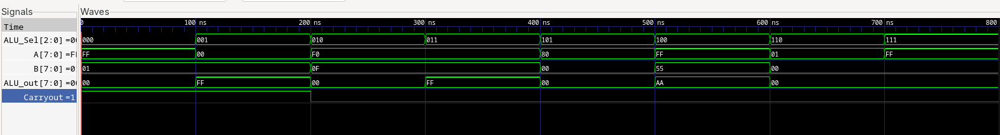

## 8-Bit ALU Implementation Using Dataflow Modeling

---

### Repository Overview

This repository contains the submission for the FPGA course's first assignment.

**Student Information:**

|**Attribute**|**Details**|
|---|---|
|**Name**|Anurag Shrestha|
|**Roll No.**|079BEI007|

#### Assignment Objective

> **Implement an 8-bit Arithmetic Logic Unit (ALU) using Dataflow Modeling in Verilog**

Following Lab-1, which introduced basic Verilog syntax and structural modeling techniques, this assignment challenged us to implement the same functionality using dataflow modeling approach. The repository includes the main Verilog modules along with their corresponding testbenches.

---

### Lab Session Context

**Date:** June 18, 2026

The lab session was structured in two distinct phases:

#### Phase 1: Foundational Building Blocks

- Basic logic gates implementation (AND gate)
    
- Progressive adder designs:
    
    - Half Adder
        
    - Full Adder
        
    - 4-bit Ripple Carry Adder
        
    - 8-bit Adder (structural modeling approach)
        

#### Phase 2: The Final Challenge

The culmination of the session was the 8-bit ALU implementation. While we had previously built adders structurally, this task required us to use **dataflow modeling** exclusively.

**Key Challenge:** Designing a multiplexer-like flow where the `ALU_SEL` (select lines) determines which operation appears at the output.

**Solution Approach:**
- Leveraged Verilog's ternary operator (`? :`)
- Created a nested conditional structure
- Quickly derived the implementation based on hands-on experience from the lab session

---

### Development Environment

#### 1. Software Stack

|**Tool**|**Purpose**|**Extensions/Plugins**|
|---|---|---|
|**Neovim**|Primary Editor|`verible` LSP, `svlangserver`|
|**VSCode**|Secondary Editor|`slang-server` (Verilog/SystemVerilog), `VeriGood` (Formatter)|

#### 2. Simulation Tools

- **Compiler:** `iverilog` (Icarus Verilog)
- **Waveform Viewer:** `gtkwave`

---

### Project Structure

The repository follows a hierarchical organization, starting from basic components and building up to the final ALU implementation.

fpga-assignment-1/
│
├── and gate/                          # Basic logic gates
│   ├── lab2.v                         # AND gate implementation
│   ├── and_gate_tb.v                  # Testbench for AND gate
│   ├── lab2.out                       # Compiled output
│   └── and_gate.vcd                   # Waveform dump
│
├── half adder/                        # Half adder implementation
│   ├── half_adder.v                   # Half adder module
│   ├── half_adder_tb.v                # Testbench
│   ├── half_adder.out                 # Compiled output
│   └── half_adder.vcd                 # Waveform dump
│
├── full adder/                        # Full adder implementation
│   ├── full_adder.v                   # Full adder module
│   ├── full_adder_tb.v                # Testbench
│   ├── half_adder.v                   # Reused half adder
│   ├── full_adder.out                 # Compiled output
│   └── full_adder.vcd                 # Waveform dump
│
├── 4-bit full adder/                  # 4-bit ripple carry adder
│   ├── bit4_adder.v                   # 4-bit adder module
│   ├── full_adder.v                   # Reused full adder
│   ├── 4-bit_full_adder_tb.v          # Testbench
│   ├── bit4_adder.out                 # Compiled output
│   └── bit4_adder.vcd                 # Waveform dump
│
├── 8-bit adder/                       # 8-bit ripple carry adder
│   ├── bit8_adder.v                   # 8-bit adder module
│   ├── full_adder.v                   # Reused full adder
│   ├── bit4_carry_adder.v             # 4-bit carry lookahead
│   ├── bit8_adder_tb.v                # Testbench
│   ├── bit8_adder.out                 # Compiled output
│   └── bit8_adder.vcd                 # Waveform dump
│
├── 8-bit ALU/                         # Structural ALU implementation
│   ├── bit8_ALU.v                     # ALU module (structural)
│   ├── bit8_ALU_tb.v                  # Testbench
│   ├── bit8_ALU.out                   # Compiled output
│   └── alu_8bit.vcd                   # Waveform dump
│
└── 8-bit ALU using dataflow/          # Final Dataflow ALU (Assignment)
    ├── bit8_ALU.v                     # ALU module (dataflow)
    ├── bit8_ALU_tb.v                  # Testbench
    ├── bit8_ALU.out                   # Compiled output
    ├── a.out                          # Alternative compilation output
    └── alu_8bit.vcd                   # Waveform dump

#### Build Progression

The directory structure shows a clear learning progression:

1. **Basic Gates** → `and gate/`
    
2. **Combinational Logic** → `half adder/` → `full adder/`
    
3. **Hierarchical Design** → `4-bit adder/` → `8-bit adder/`
    
4. **Structural ALU** → `8-bit ALU/`
    
5. **Dataflow ALU** → `8-bit ALU using dataflow/` _(Final Assignment)_
    

---

### ALU Specifications

#### Operation Set

The ALU supports 8 operations, selected via 3-bit `ALU_SEL`:

|**ALU_SEL**|**Operation**|**Description**|**Expression**|
|---|---|---|---|
|`000`|ADD|Arithmetic Addition|A + B|
|`001`|SUB|Arithmetic Subtraction|A - B|
|`010`|AND|Bitwise AND|A & B|
|`011`|OR|Bitwise OR|A \| B|
|`100`|XOR|Bitwise XOR|A ^ B|
|`101`|SHL|Shift Left|A << B|
|`110`|SHR|Shift Right|A >> B|
|`111`|NOT|Bitwise Complement|~A|

#### Input/Output Interface

|**Port**|**Width**|**Direction**|**Description**|
|---|---|---|---|
|`A`|8-bit|Input|First operand|
|`B`|8-bit|Input|Second operand|
|`ALU_SEL`|3-bit|Input|Operation selector|
|`OUT`|8-bit|Output|Result of operation|
|`cout`|1-bit|Output|Carry out (for ADD/SUB)|

---

### Simulation Results

#### Testbench 1 Output

_Comprehensive test covering all 8 operations with random input values_

